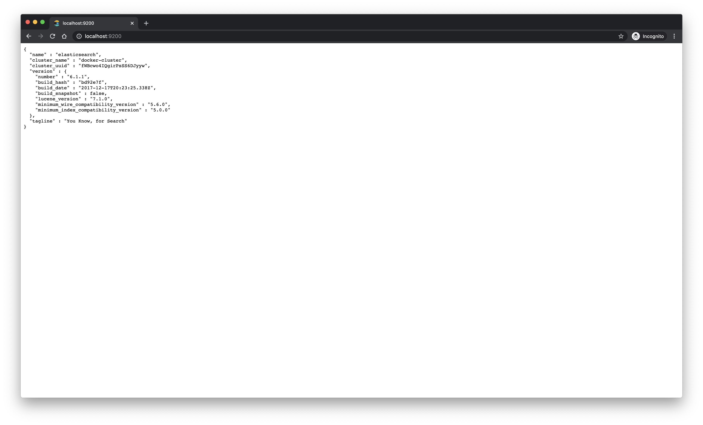
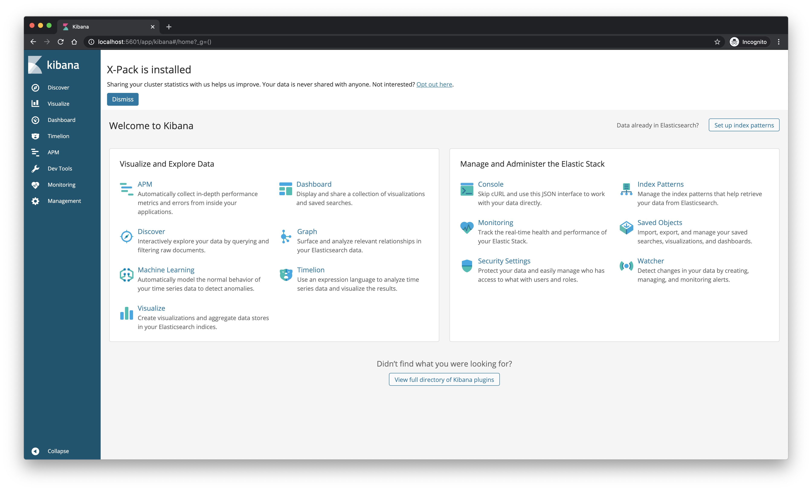

# elasticsearch-with-seunjeon
dockerize elasticsearch 6.1.1 container with seunjeon 6.1.1.1 plugin as Korean analyzer

- elasticsearch http://localhost:9200

- kibana http://localhost:5601

- seunjeon https://bitbucket.org/eunjeon/seunjeon/src/master/elasticsearch/

cf. how to install mecab-ko and mecab-ko-dic -> https://bitbucket.org/eunjeon/mecab-ko-lucene-analyzer/src/master/
